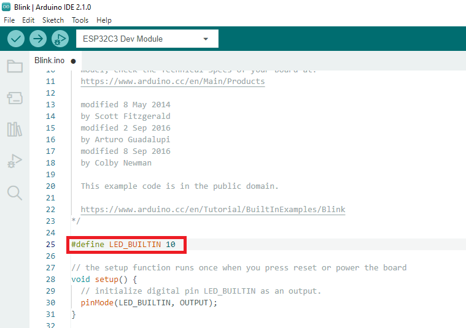
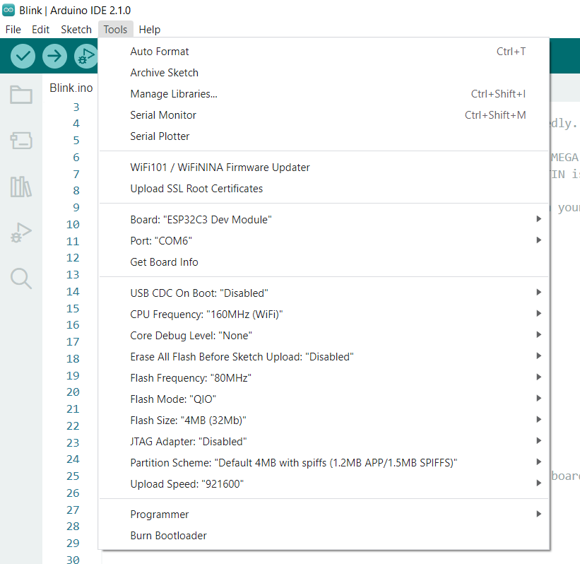
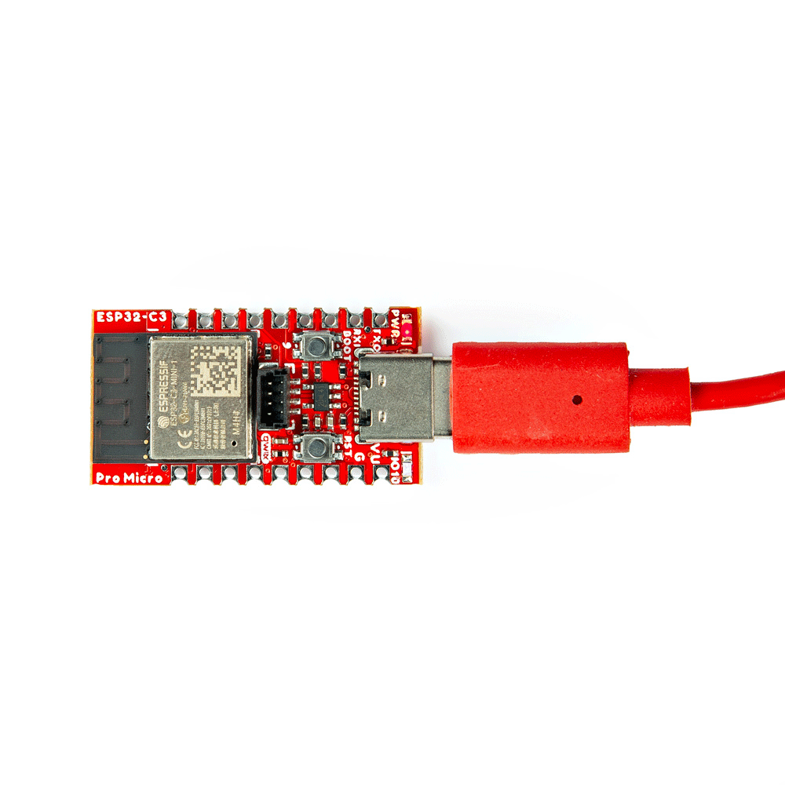

Now that we've installed the espressif boards package in Arduino, it's time to upload our first sketch to make sure everything is working properly.

## Example 1 - Blink 

This basic example makes sure the board package installed correctly and the board accepts programming properly to blink the blue IO10 LED on the board every second. Open the example in Arduino by navigating to File > Examples > Basics > 01-Blink.

You will need to define LED_BUILTIN as 10 like so: 

<figure markdown>
[{ width="400" }](assets/img/DefineLED_BUILTIN.png "Click to enlarge")
<figcaption markdown>Code changes for LED_BUILTIN</figcaption>
</figure>

Make sure you have the board and port selected like so: 

<figure markdown>
[{ width="400" }](assets/img/BoardandPort.png "Click to enlarge")
<figcaption markdown>Board and Port selected</figcaption>
</figure>

### Uploading Code

Before uploading, you'll need to put the board into the <a href="https://docs.espressif.com/projects/esptool/en/latest/esp32/advanced-topics/boot-mode-selection.html#select-bootloader-mode">serial bootloader</a> with the <kbd>BOOT</kbd> button. Holding down the <kbd>BOOT</kbd> button, while connecting the board to a computer through its USB-C connector or resetting the board will cause the MCU to enter the <a href="https://docs.espressif.com/projects/esptool/en/latest/esp32/advanced-topics/boot-mode-selection.html#manual-bootloader">Firmware Download mode</a> and its serial bootloader. The board will remain in this mode until it power cycles (happens automatically after uploading new firmware) or the <kbd>RST</kbd> button is pressed.

1. Hold the <kbd>BOOT</kbd> button down.
2. Reset the MCU.
    * While unpowered, connect the board to a computer with through the USB-C connection.
    * While powered, press the <kbd>RST</kbd> button.
3. Release the <kbd>BOOT</kbd> button.
4. After programming is completed, reboot the MCU.
    * Press the <kbd>RST</kbd> button.
    * Power cycle the board. 

Once the board is in the serial bootloader, you can upload code through the Arduino interface. Once your code is uploaded, you will need to hit the <kbd>RST</kbd> button to get your sketch running. 

<figure markdown>
[{ width="400" }](assets/img/ESP32-Pro-Micro-Gif.gif "Click to enlarge")
<figcaption markdown>*blink blink blink*</figcaption>
</figure>
