## ESP32 C3 WiFi Module

The ESP32-C3 from Espressif is a single-core, 32-bit, RISC-V-based MCU with 400KB of SRAM, which is capable of running at 160MHz. It has integrated 2.4 GHz Wi-Fi and Bluetooth 5 (LE) with a long-range support. It has 22 programmable GPIOs with support for ADC, SPI, UART, I2C, I2S, RMT, TWAI, and PWM. More information is available in the [datasheet](Documents/esp32-c3-mini-1_datasheet_en.pdf). 

<figure markdown>
[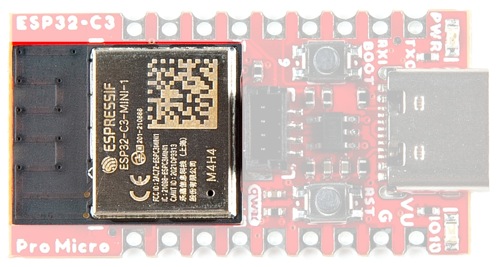{ width="400" }](assets/img/23484-Pro-Micro-ESP32-C3-ESP32C3.jpg "Click to enlarge")
<figcaption markdown>ESP32 C3 WiFi Module</figcaption>
</figure>

## Voltage Regulator - RT9080

The RT9080 regulates voltage to the various components of the board. Maximum input voltage should be no more than <b>5.5V</b>. 

Current Max: 600mA

<figure markdown>
[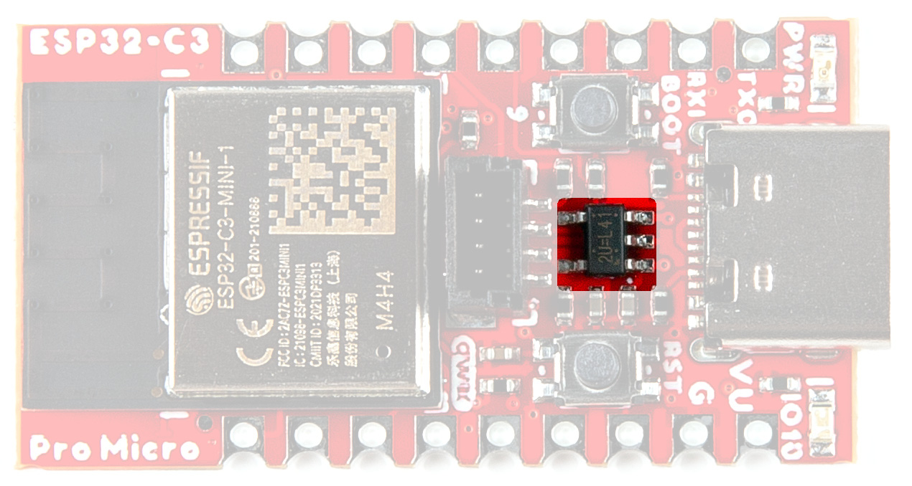{ width="400" }](assets/img/23484-Pro-Micro-ESP32-C3-VoltageReg.jpg "Click to enlarge")
<figcaption markdown>Voltage Regulator - RT9080</figcaption>
</figure>

## Qwiic Connector

The board includes a Qwiic connector for use with our vast array of Qwiic sensors. For users that need to solder directly to the board, the pins are also broken out on the edge PTH. The I2C data and clock lines are also tied to 2.2kΩ pull-up resistors.

<figure markdown>
[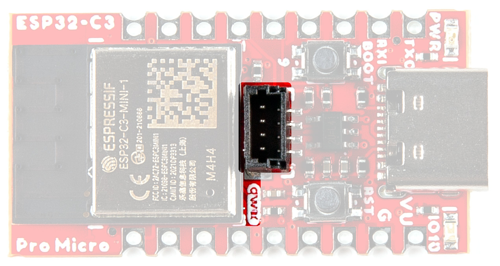{ width="400" }](assets/img/23484-Pro-Micro-ESP32-C3-QwiicConnex.jpg "Click to enlarge")
<figcaption markdown>Qwiic Connector</figcaption>
</figure>

## JTAG 

While most users will utilize the USB connection for programming, the ESP32-C3 can also be programmed through its JTAG or SWD pins. This is useful for individuals developing and debugging firmware that would be flashed directly onto the module, such as in production for commercial applications. We recommend soldering a [2x5 Male Pin header](https://www.sparkfun.com/products/15362) for use. 

<figure markdown>
[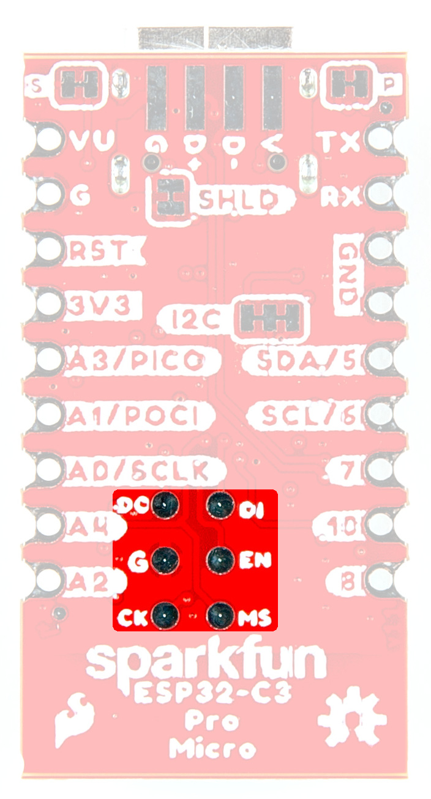{ width="400" }](assets/img/23484-Pro-Micro-ESP32-C3-JTAG.jpg "Click to enlarge")
<figcaption markdown>ESP32 JTAG pads</figcaption>
</figure>

## Castellated Headers

The castellated headers along either side of the board are useful for adding complex functionality like RF to a design, as well as being low profile and compact. If you've never worked with castellated headers, head on over to our [Castellated Mounting Holes Tutorial](https://learn.sparkfun.com/tutorials/how-to-solder-castellated-mounting-holes) for more information. 

<figure markdown>
[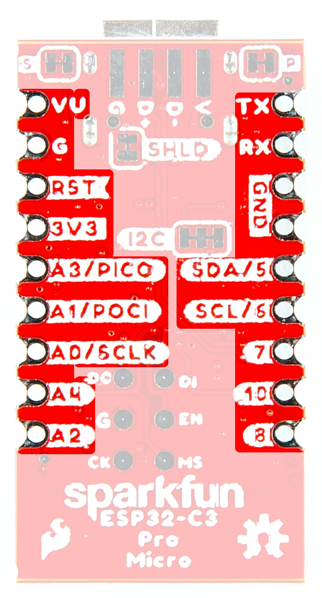{ width="400" }](assets/img/23484-Pro-Micro-ESP32-C3-GPIO.jpg "Click to enlarge")
<figcaption markdown>Castellated Headers</figcaption>
</figure>

## Buttons

There are two buttons on the board - Reset and Boot. The reset (RST) button allows users to reset the program running on the ESP32-C3 module without unplugging the board. The Boot Button allows the user to manually put the board into Bootloader Mode. To enter bootloader, hold the Boot button down when the ESP32 resets or powers on. 

<figure markdown>
[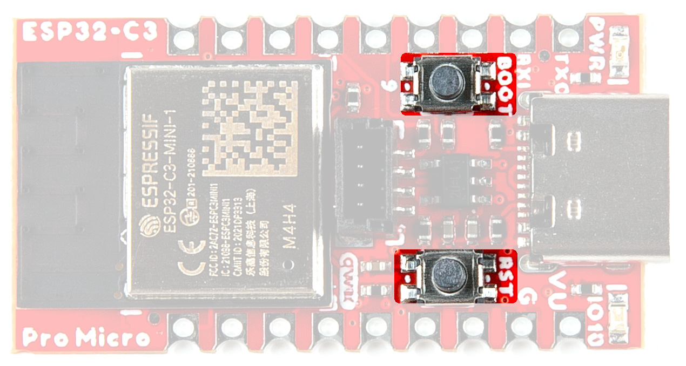{ width="400" }](assets/img/23484-Pro-Micro-ESP32-C3-Buttons.jpg "Click to enlarge")
<figcaption markdown>Boot and Reset Buttons</figcaption>
</figure>

## LEDs

Two LEDs - Power(Red) and STAT(Blue) - show the user that power has been appropriately supplied to the board and the status of the data transfer. 

<figure markdown>
[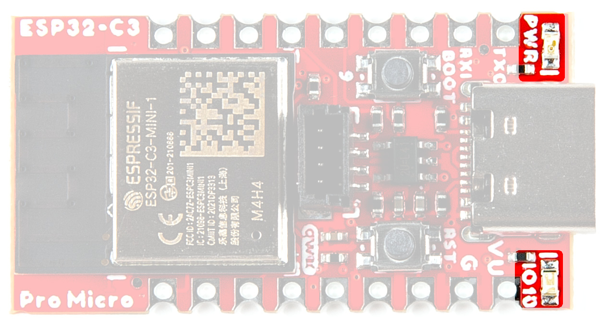{ width="400" }](assets/img/23484-Pro-Micro-ESP32-C3-LEDs.jpg "Click to enlarge")
<figcaption markdown>Power and Status LEDs</figcaption>
</figure>

## Jumpers

??? note "Never modified a jumper before?"
	Check out our <a href="https://learn.sparkfun.com/tutorials/664">Jumper Pads and PCB Traces tutorial</a> for a quick introduction!
	

		<a href="https://learn.sparkfun.com/tutorials/664">
		 
        How to Work with Jumper Pads and PCB Traces</a>
	

### I2C Jumper

If you choose to use one or more Qwiic breakouts in your project, it is important to note that this board comes equipped with pull-up resistors on the clock and data pins. If you are daisy-chaining multiple Qwiic devices, you will want to cut this jumper; if multiple sensors are connected to the bus with the pull-up resistors enabled, the parallel equivalent resistance will create too strong of a pull-up for the bus to operate correctly. As a general rule of thumb, disable all but one pair of pull-up resistors if multiple devices are connected to the bus. To disable the pull up resistors, use an X-acto knife to cut the joints between theWS jumper pads highlighted below.

<figure markdown>
[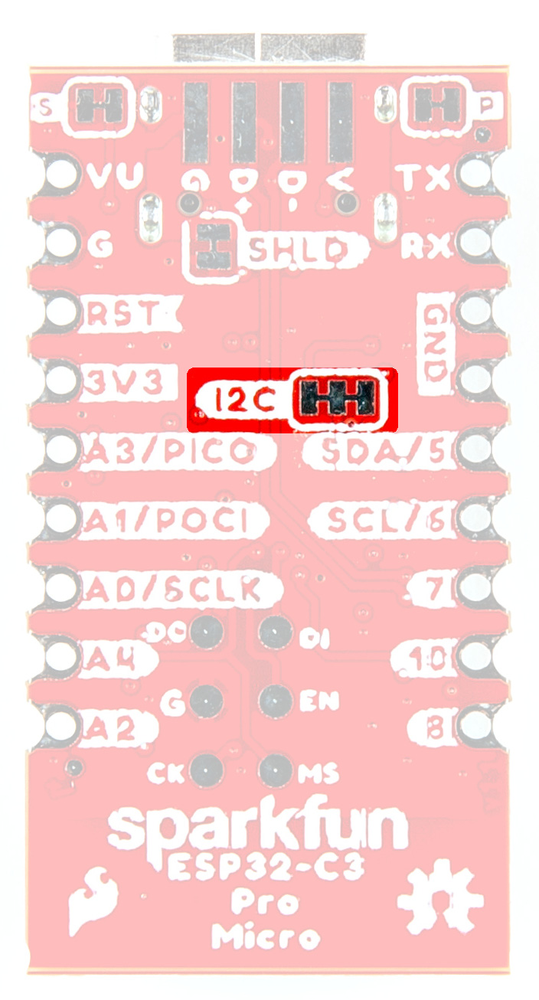{ width="400" }](assets/img/23484-Pro-Micro-ESP32-C3-I2CJumper.jpg "Click to enlarge")
<figcaption markdown>I2C Jumpers</figcaption>
</figure>

### LED Jumpers

If power consumption is an issue or you wish to disable the LEDs on the front of the board, cut the trace between the jumpers shown here. 

<figure markdown>
[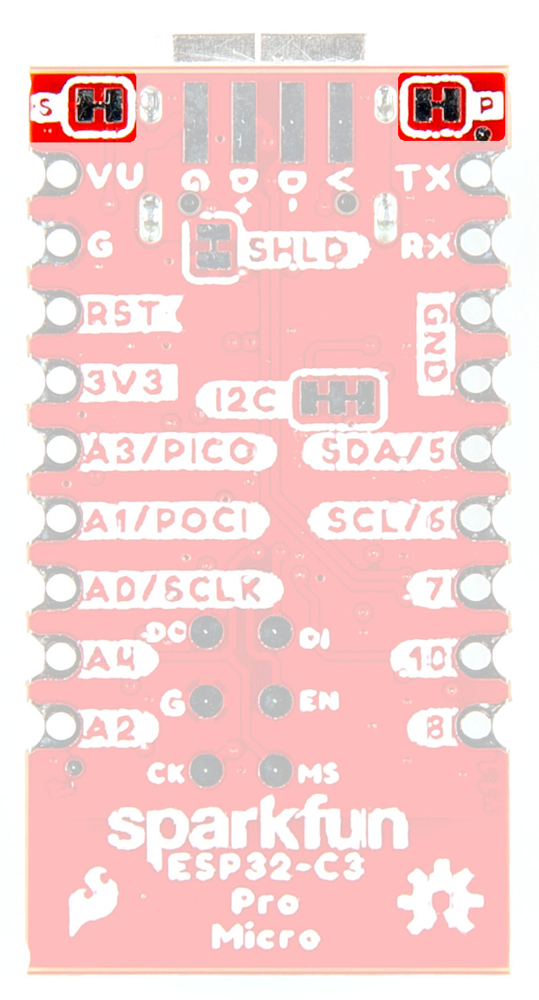{ width="400" }](assets/img/23484-Pro-Micro-ESP32-C3-PwrStatJumpers.jpg "Click to enlarge")
<figcaption markdown>LED Jumpers</figcaption>
</figure>

### Shield Jumper

For most applications, the single point grounding of the USB-C connector is sufficient. However, should you run into problems with EMI/EMC, we've provided a jumper that allow you to disconnect the USB Shield from ground.

<figure markdown>
[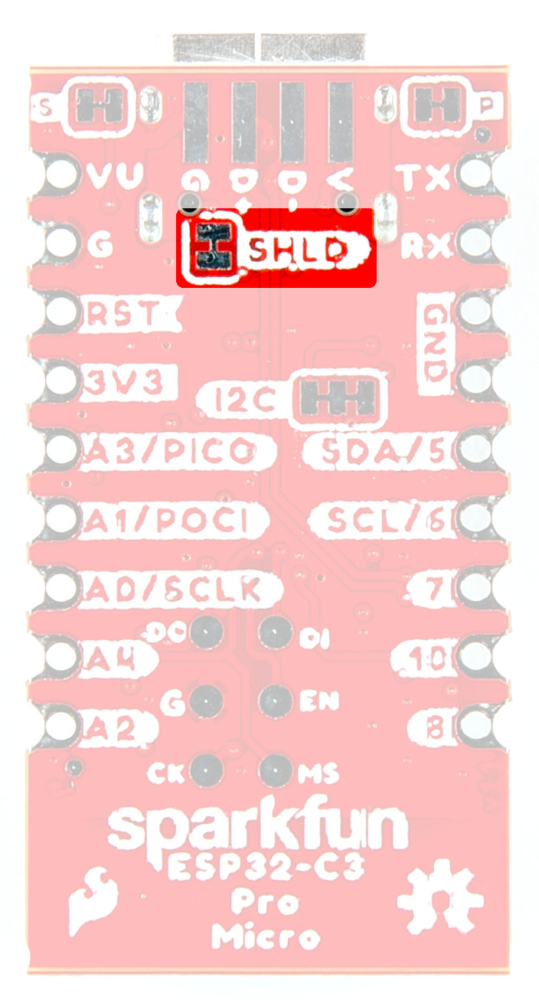{ width="400" }](assets/img/23484-Pro-Micro-ESP32-C3-SHLDJumper.jpg "Click to enlarge")
<figcaption markdown>Shield Jumpers</figcaption>
</figure>

## Board Dimensions

The SparkFun ESP32-C3 Pro Micro measures 0.7" x 1.3". 

<figure markdown>
[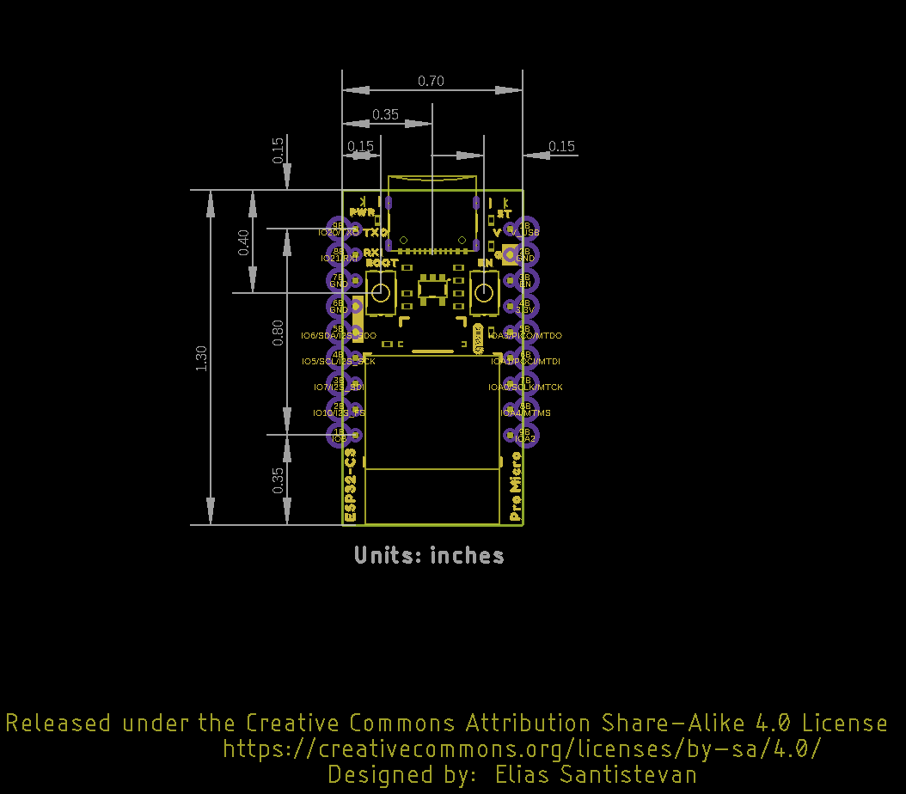{ width=90% }](assets/board_files/SparkFun_ESP32_C3_Pro_Micro_BoardDimensions.png "Click to enlarge")
<figcaption markdown>SparkFun ESP32-C3 Pro Micro Board Outline</figcaption>
</figure>

??? tip "Need more measurements?"
	For more information about the board's dimensions, users can download the [Eagle files](assets/board_files/SparkFun_ESP32_C3_Pro_Micro_EagleFiles.zip). These files can be opened in Eagle and additional measurements can be made with the dimensions tool.

	??? info ":octicons-download-16:{ .heart } Eagle - Free Download!"
		Eagle is a [CAD]("computer-aided design") program for electronics that is free to use for hobbyists and students. However, it does require an account registration to utilize the software.

		

		[Download from :autodesk-primary:{ .autodesk }](https://www.autodesk.com/products/eagle/free-download "Go to downloads page"){ .md-button .md-button--primary width="250px" }
		

	
	??? info ":straight_ruler: Dimensions Tool"
		This video from Autodesk demonstrates how to utilize the dimensions tool in Eagle, to include additional measurements:

		

		

		<iframe src="https://www.youtube.com/embed/dZLNd1FtNB8" title="EAGLE Dimension Tool" frameborder="0" allow="accelerometer; autoplay; clipboard-write; encrypted-media; gyroscope; picture-in-picture" allowfullscreen></iframe>
		

		

