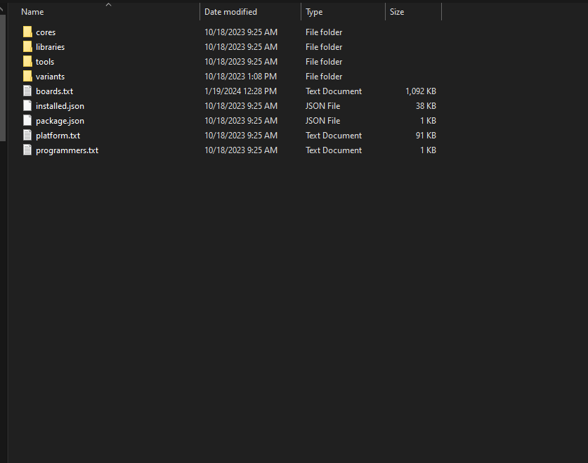
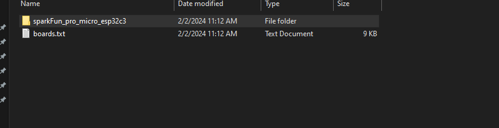
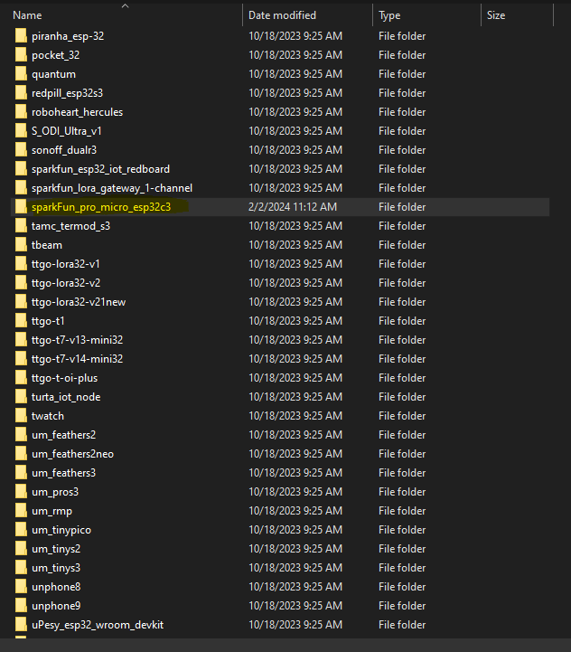
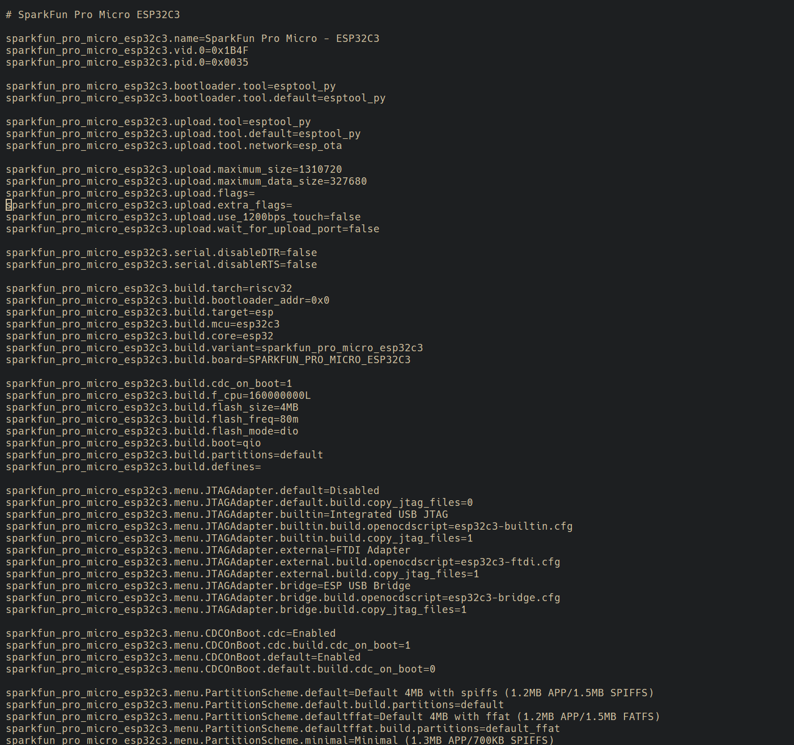
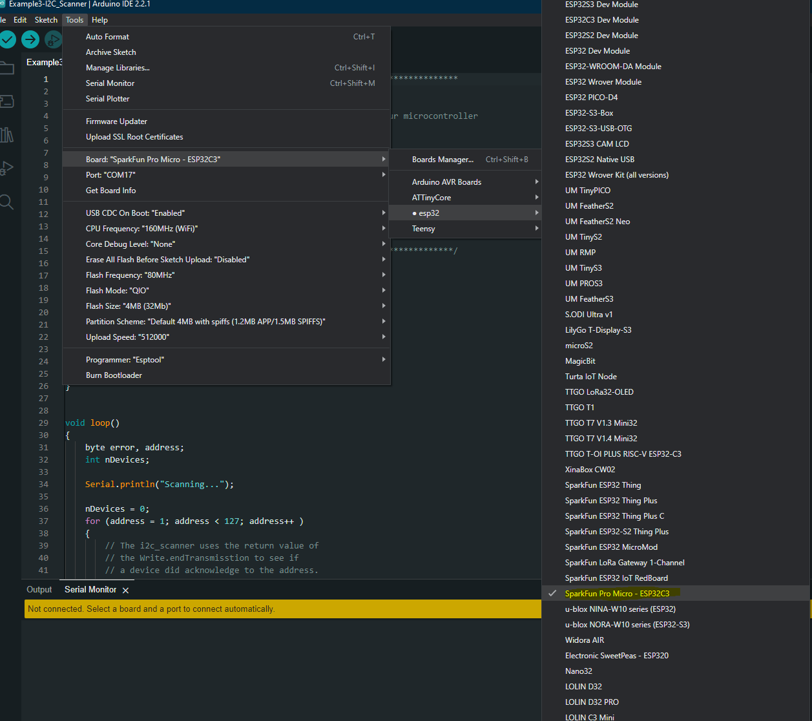

!!! arduino

    ### Arduino IDE

    This example assumes you are using the latest version of the Arduino IDE on your desktop. If this is your first time using Arduino IDE and an library, please review the following tutorials.

    - [Installing the Arduino IDE](https://learn.sparkfun.com/tutorials/installing-arduino-ide)
    - [Installing an Arduino Library](https://learn.sparkfun.com/tutorials/installing-an-arduino-library)

    ### USB-to-Serial Drivers

    If you've never connected an CH340 device to your computer before, you may need to install drivers for the USB-to-serial converter. Check out our section on "[How to Install CH340 Drivers](https://learn.sparkfun.com/tutorials/sparkfun-serial-basic-ch340c-hookup-guide#drivers-if-you-need-them)" for help with the installation.

## Installation (Windows)

The SparkFun Pro Micro - ESP32-C3 board files are waiting on an official release from the Espressif Arduino Core. In the meantime you can add the board files manually. There is a file included in the [SparkFun_Pro_Micro-ESP32C3 Github Repository](https://github.com/sparkfun/SparkFun_Pro_Micro-ESP32C3/tree/main/Arduino_Board_Files) titled "Arduino_Board_Files", which contains a "Variant" folder labeled "sparkfun_pro_micro_esp32c3" and a "sparkfun_boards.txt" file. The variant file will need to be placed locaally into your machine and the contents of the "sparkfun_boards.txt" will need to be copied into the local "boards.txt" file.

All of the Espressif Arduino Core files on your local computer can be found here on a Windows 10 machine: 

    C:\Users\<USERNAME>\AppData\Local\Arduino15\packages\esp32\hardware\esp32 

Make sure you change USERNAME to your name! 

You'll see a folder located here with some version number depending on what you have installed. Within that folder there are directores that look like the following:

<figure markdown>
[{ width="600" }](assets/img/esp32_core_file_structure_overview.png "Click to enlarge")
<figcaption markdown>Core Files</figcaption>
</figure>

Here is where we'll "install" the files for the SparkFun Pro Micro ESP32-C3. First you'll take the variant folder named "sparkfun_pro_micro_esp32c3" and drag and drop it within the "variants" folder on your local machine.

From: 

<figure markdown>
[{ width="600" }](assets/img/image_of_variant_file_within_github_repository.png "Click to enlarge")
<figcaption markdown>SparkFun Variant file within Github Repository</figcaption>
</figure>

To: 

<figure markdown>
[{ width="600" }](assets/img/sparkfun_variant_folder_within_esp32_variants_folder.png "Click to enlarge")
<figcaption markdown>SparkFun Variant file within ESP32 Variants File</figcaption>
</figure>

We're almost there. Next we're going to copy the text WITHIN the "sparkfun_boards.txt" found in the Github Repository and paste it into the "boards.txt" file within the Espressif Arduino Core on your local computer. First open the both the "boards.txt" file from you local machine and the "sparkfun_boards.txt". Now copy the entire text from the "sparkfun_boards.txt" file to the END of the "boards.txt" file.

<figure markdown>
[{ width="600" }](assets/img/board_file_copy_paste.png "Click to enlarge")
<figcaption markdown>Boards File</figcaption>
</figure>

That's it. Now when you go to open the Arduino IDE and navigate to the esp32 core within the boards options you should see it show up there. 

<figure markdown>
[{ width="600" }](assets/img/Sparkfun_pro_micro_within_Arduino_IDE.png "Click to enlarge")
<figcaption markdown>SparkFun Pro Micro in Arduino IDE</figcaption>
</figure>

<!--

#### Install Board Definition
Install the latest <b>ESP32</b> board definitions in the Arduino IDE.

    
<b>Note:</b> For more instructions, users can follow this tutorial on <a href="https://docs.arduino.cc/learn/starting-guide/cores">Installing Additional Cores</a> provided by Arduino. Users will also need the <code>.json</code> file for the Espressif Arduino core:

    
    

        <a href="https://raw.githubusercontent.com/espressif/arduino-esp32/gh-pages/package_esp32_index.json"><code>https://raw.githubusercontent.com/espressif/arduino-esp32/gh-pages/package_esp32_index.json</code></a>
    

-->
<!--When selecting a board to program in the Arduino IDE, users should select the **SparkFun ESP32 Thing Plus C** from the Tools drop down menu *(i.e. **Tools** > **Board** > **ESP32 Arduino** > **SparkFun ESP32 Thing Plus C**)*. Alternatively, users can also select the **ESP32 Dev Module**; however, they may loose some pin assignments (i.e. `LED_BUILTIN`).

->  <-
-> *Selecting the **SparkFun ESP32 Thing Plus C** from the Tools drop down menu in the Arduino IDE. (Click to enlarge)* <-

    
<b>Note:</b> In the Arduino 2.0.x IDE users can also select the board from the <code>Select Board</code> drop down menu and search for the <b>SparkFun ESP32 Thing Plus C</b>:

    
    

        
         
        <i>Selecting the <b>SparkFun ESP32 Thing Plus C</b> in the Arduino 2.0.x IDE. (Click to enlarge)</i> 
    

-->

